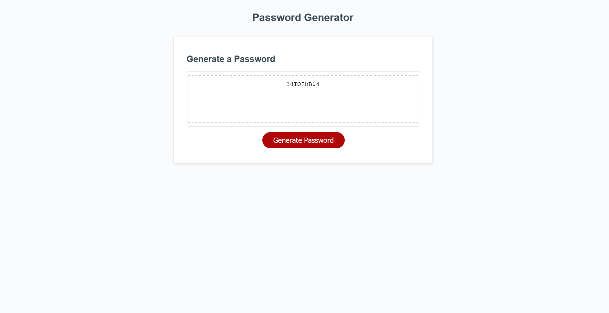

# Random Password Generator

## Description

A password generator that allows you to create a random password with a length between 8 and 128 characters. You can reach the site with this [link](https://tutor78.github.io/password-generator/).

## Use

* Click the generate password button
* Choose a password length between 8 and 128 characters
* Choose what types of characters should be included by either confirming or canceling the following prompts
* Enjoy your password

## Preview

## Languages

- HTML
- CSS
- Javascript

## License

This project is licensed under [GNU GPLv3](LICENSE).
